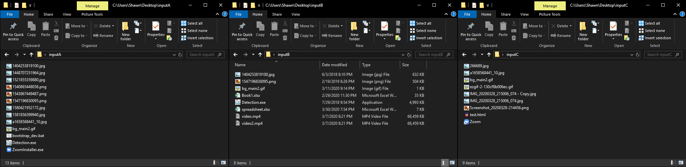
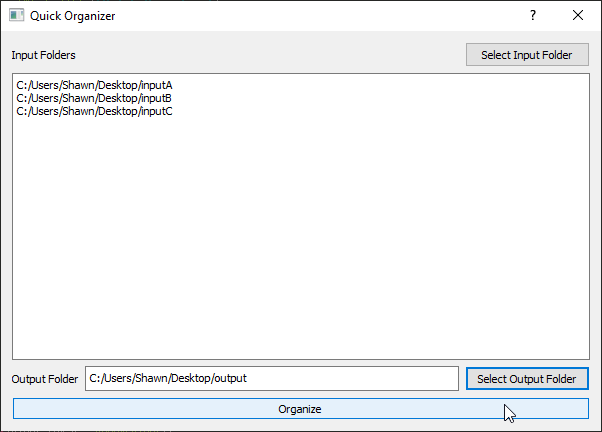
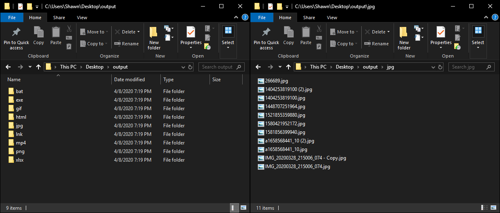

# file-organizer

A simple GUI application that organizes files from multiple sources into an output folder, 
sorting each file into subfolders by file type.

### Usage
Execute start.bat, then simply select all input folders, select an output folder, the press the 'Organize' button.

### Demo

##### Input directories before organizing:

##### Python Organizer:

##### Output directory after organizing:

### TODO

- refactor the code a bit
- use shutil instead of os to move files
- make it pretty
- create proper executable